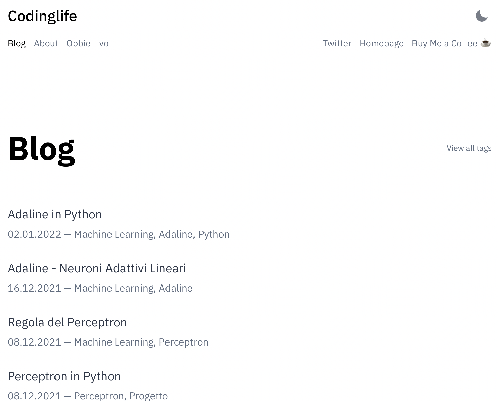
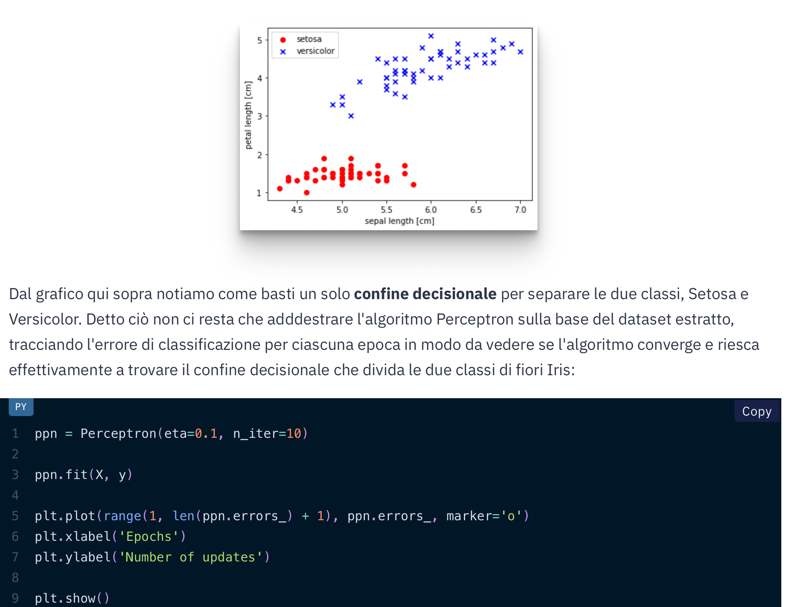

# Codinglife.it 

> Blog / Machine Learning / Intelligenza Artificiale

## Immagini e GIF

# Indice

- [Obbiettivo](#obbiettivo)
- [Progetti](#progetti)
- [Risorse](#risorse)
- [Community](#community)

# Obbiettivo

Perchè **Codinglife** è il blog che fa per te ?

Con il passare degli anni, tra mille problemi nel campo della programmazione e insidie che il percorso formativo ti presenta, sono riuscito a creare un metodo di ragionamento e un livello di conoscenza tale da poter condividere quante più informazioni nell'ambito del Machine Learning a te che sei un appassionato di questa meravigliosa materia.

Nel mio **Blog** trovi moltissimi argomenti in ambito di *intelligenza artificiale*, trattati sia a livello puramente teorico che attraverso l'utilizzo di *Python* e altre tecnologie senza le quali non avrei potuto mettere in pratica le mie conoscenze e i miei studi. Cerco, in buona fede, di permettere a Te che leggi di trovare delle risposte, in maniera più contestualizzata possibile, alle difficoltà e ai problemi che una materia complicata, ma allo stesso tempo affascinante, ti sbatte in faccia.

Ho deciso infatti di creare un **percorso formativo**, articolo dopo articolo, con il quale potrai gettare delle solide basi su quel che riguarda tutto il mondo del **Machine Learning** e le sue mille sfaccetatture. Seguendo gli argomenti dal primo all'ultimo articolo potrai quindi capire determinati concetti e colmare delle lacune che da solo non riusciresti a riempire.

# Progetti

All'interno del mio [sito](https://www.codinglife.it) è presente la sezione Progetti. In essa ho deciso di inserire tutti i progetti relativi al Machine Learning, strutturati in maniera tale da mettere in pratica ciò che è spiegato all'interno degli articoli. Infatti sono dei file di documentazione che spiegano, passo dopo passo, come portare a termine un obbiettivo riguardante, per esempio, il Perceptron o la creazione in Python dell'algoritmo Adaline. 

Ogni pagina di progetto è costituita da:

- Spiegazione dell'obbiettivo da raggiungere;
- Riassunto parte teorica;
- Implementazione del codice Python;
- Considerazioni finali;

# Risorse

All'interno del mio Blog hai la possibilità di intraprendere un percorso formativo completo dalla A alla Z per quanto riguarda il mondo del Machine Learning. 
Tutto ciò in maniera gratuita e alla portata di tutti, infatti, cerco nel migliore dei modi di trasmettere informazioni utili e che riescano a formare un'idea precisa in chi legge dell'argomento che si sta trattando. 

Per facilitare ancora di più l'apprendimento metto a disposizione dei file scaricabili di ciò che si sta trattando in modo tale da avere sotto controllo il codice di uno specifico algoritmo così da verificarne possibili errori di scrittura o di implementazione. 

# Community

Essendo un nuovo progetto sto cercando di formare una community sempre più importante a livello di numeri, ma ciò che conta veramente è la qualità delle persone che leggono e partecipano alle mie discussioni e ai miei progetti. Appassionati, studenti, curiosi e così via. Tutti sono ben accetti affinchè apportino alla community un aiuto o considerazioni che vanno a migliorare la qualità del blog. 

Per qualsiasi dubbio o richiesta sono disponibile in qualsiasi momento e cerco di rispondere alla Tua richiesta nella maniera più rapida possibile. 

Contattami all'indirizzo email personale:

> manuelenzo2000@gmail.com

Mi trovi nei principali social e può contattarmi anche attraverso queste piattaforme:

- [Twitter](https://twitter.com/Codinglife_it)
- [Instagram](https://www.instagram.com/coding_life.it/)
- [Facebook](https://www.facebook.com/codinglife.it)

Se ciò che leggi è interessante e può aiutarti in qualsiasi modo, mi farebbe piacere ricevere un piccolo compenso, il prezzo di un semplice caffè, che per me significherebbe molto, sopratutto per portare avanti questo progetto che mette in contatto ogni giorno centinaia di persone, tutti appassionati di questo meraviglioso mondo, il Machine Learning:

- ☕️ [Buy me a Coffee](https://www.buymeacoffee.com/codinglife) 

## Manuel Enzo - Copyright 2022 - Codinglife.it
